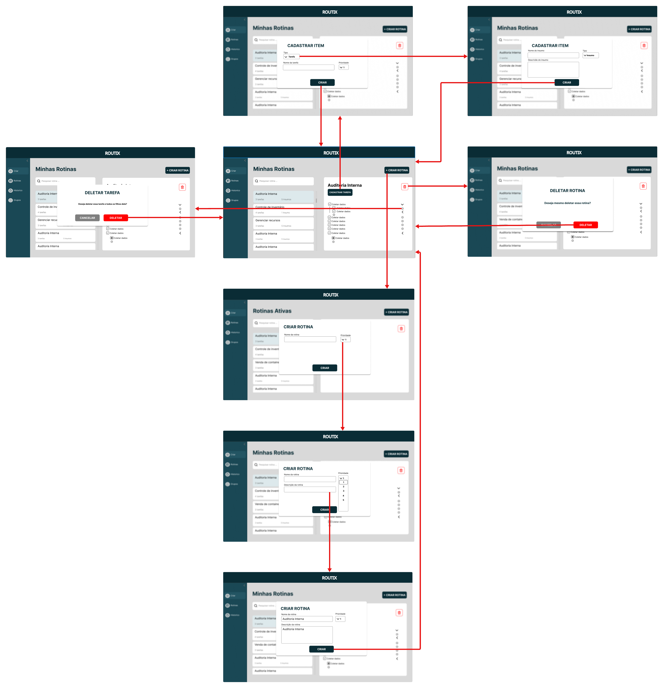
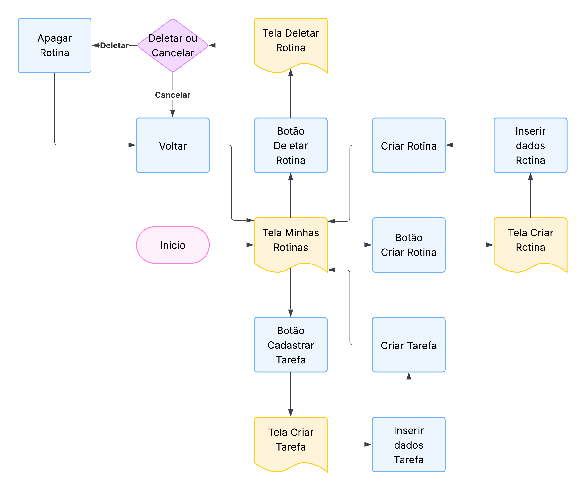
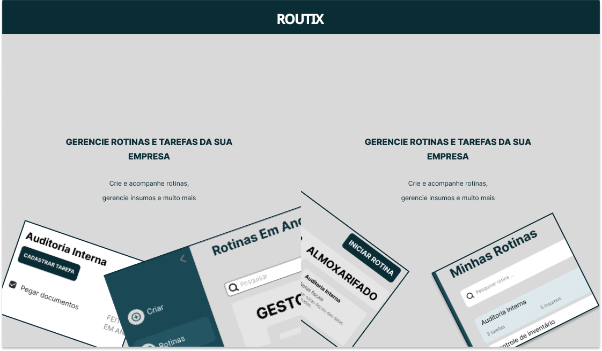
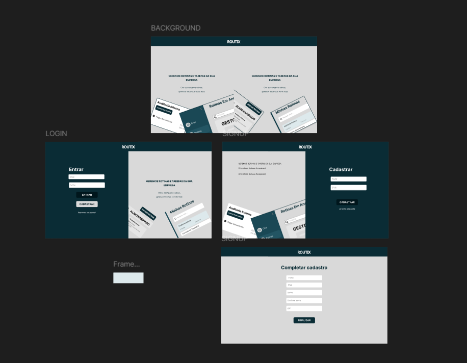
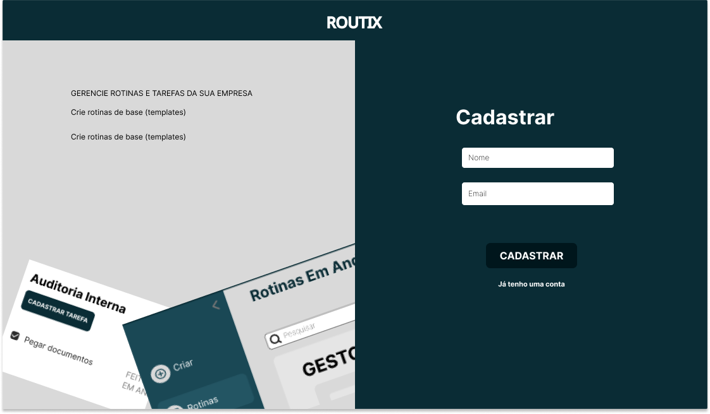
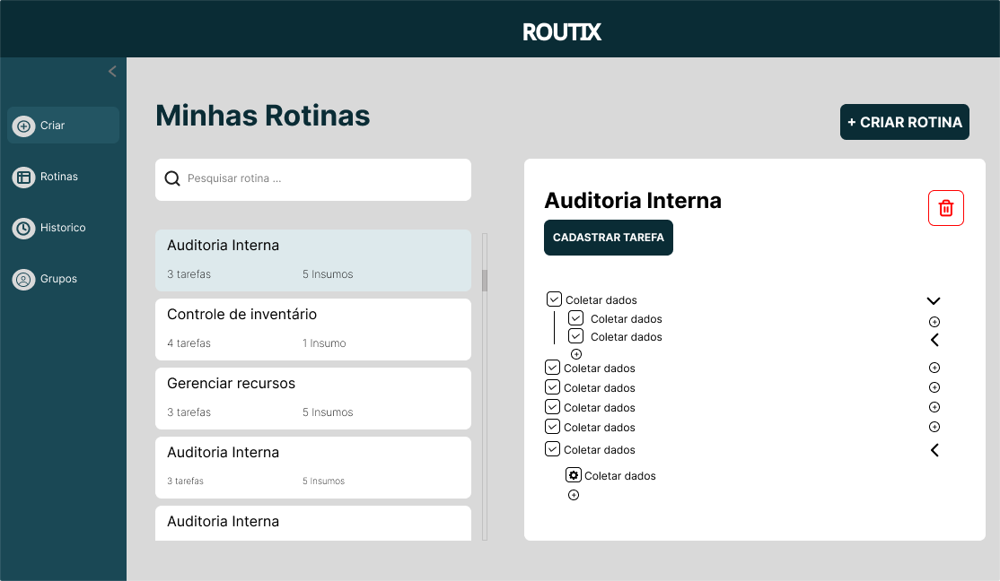
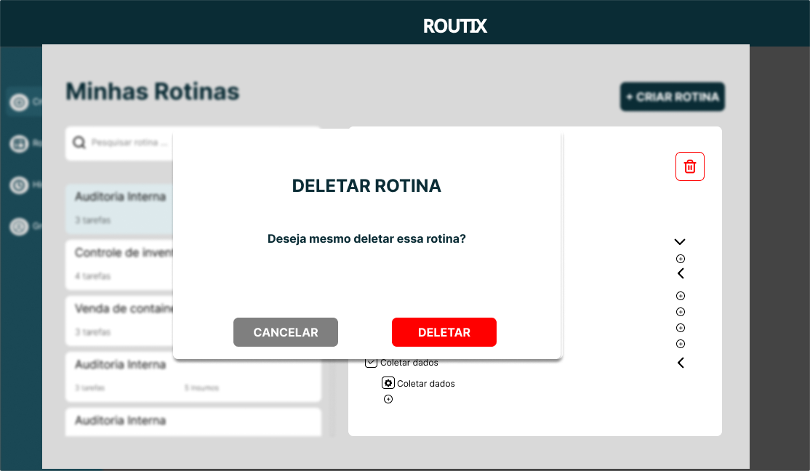

# Projeto de interface

Pré-requisitos: <a href="02-Especificacao.md"> Especificação do projeto</a>

Visão geral da interação do usuário pelas telas do sistema e protótipo interativo das telas com as funcionalidades que fazem parte do sistema (wireframes).

 Apresente as principais interfaces da plataforma. Discuta como ela foi elaborada de forma a atender os requisitos funcionais, não funcionais e histórias de usuário abordados na <a href="02-Especificacao.md"> Especificação do projeto</a>.

 ## User flow

A imagem apresenta o fluxo de navegação da interface do sistema Routix, especificamente relacionado à gestão de rotinas e tarefas. O diagrama mostra, de forma estruturada, as telas pelas quais o usuário pode transitar ao criar, editar, deletar ou associar itens a uma rotina. As setas vermelhas indicam o caminho entre as diferentes funcionalidades, permitindo visualizar como as ações se encadeiam dentro da aplicação. Essa representação é fundamental para entender a lógica de interação do usuário com o sistema, auxiliando tanto no desenvolvimento quanto na validação da usabilidade.

### Diagrama de fluxo

A imagem ilustra um fluxograma de navegação funcional do sistema Routix, demonstrando as principais ações disponíveis ao usuário relacionadas à criação, visualização e exclusão de rotinas e tarefas. O diagrama segue um fluxo lógico, partindo da tela inicial até os diferentes caminhos possíveis, como cadastrar uma nova tarefa, criar uma rotina ou excluir uma existente. Cada decisão e etapa do processo está representada por diferentes formas geométricas, facilitando a compreensão da sequência de interações dentro do sistema. Este fluxo é essencial para o mapeamento da lógica de uso e para orientar tanto o desenvolvimento quanto a experiência do usuário.

## Wireframes

São protótipos usados no design de interface para sugerir a estrutura de um site web e seu relacionamento entre suas páginas. Um wireframe web é uma ilustração que mostra o layout dos elementos fundamentais na interface.

 
> **Links úteis**:
> - [Protótipos: baixa, média ou alta fidelidade?](https://medium.com/ladies-that-ux-br/prot%C3%B3tipos-baixa-m%C3%A9dia-ou-alta-fidelidade-71d897559135)
> - [Protótipos vs wireframes](https://www.nngroup.com/videos/prototypes-vs-wireframes-ux-projects/)
> - [Ferramentas de wireframes](https://rockcontent.com/blog/wireframes/)
> - [MarvelApp](https://marvelapp.com/developers/documentation/tutorials/)
> - [Figma](https://www.figma.com/)
> - [Adobe XD](https://www.adobe.com/br/products/xd.html#scroll)
> - [Axure](https://www.axure.com/edu) (Licença Educacional)
> - [InvisionApp](https://www.invisionapp.com/) (Licença Educacional)

## Interface do sistema

A interface do Routix foi desenvolvida com foco na simplicidade e na fluidez da experiência do usuário. A plataforma oferece uma navegação intuitiva por meio de telas organizadas, permitindo o gerenciamento eficiente de rotinas e tarefas. As principais interfaces incluem visualização e criação de rotinas, cadastro de tarefas e confirmação de exclusão, todas pensadas para tornar o uso do sistema direto e funcional.

### Tela principal do sistema

A tela principal do Routix apresenta, de forma clara e visual, as principais funcionalidades da plataforma. Nela, o usuário tem uma visão geral dos recursos disponíveis, como a criação de rotinas, o cadastro de tarefas e o acompanhamento de suas atividades.

> 

###  Telas do processo 1 - Cadastro de Usuários

##  Tela de Login

A tela de login do Routix oferece uma entrada segura e direta ao sistema, solicitando as credenciais do usuário por meio de e-mail e senha. Seu objetivo principal é autenticar usuários já cadastrados, garantindo acesso personalizado às funcionalidades da plataforma.
> 

##  Tela de SignUp

Coleta informações iniciais do usuário, como parte do processo de criação de conta. A interface é simples e objetiva, com campos básicos que marcam o início da jornada do usuário na plataforma. A ação principal da tela é permitir que o usuário avance para a próxima etapa do cadastro, por meio de um botão de navegação que direciona para a coleta de dados completos. Na segunda etapa, o sistema solicita informações mais detalhadas, como nome completo, e-mail, CPF, senha e confirmação de senha. O foco desta tela é finalizar o cadastro com segurança e precisão, garantindo que todos os dados fornecidos estejam corretos antes de liberar o acesso ao sistema.
> 

### Telas do processo 2 - Cadastro de Rotinas

##  Tela Home

A tela Home do Routix é o ponto central da navegação do sistema, projetada para oferecer uma visão ampla e clara do gerenciamento de rotinas e equipes. Cada rotina é apresentada em formato de cartão, contendo botões de ação para editar, executar ou excluir, permitindo uma gestão rápida e eficiente.
Os cartões destacam informações essenciais como o responsável pela rotina, seu status atual e um indicador visual de progresso, que mostra de forma clara as etapas concluídas, pendentes e em execução. Isso facilita o acompanhamento e a tomada de decisão pelo usuário.
Na lateral da interface, um menu expandido exibe ícones acompanhados de textos para facilitar a navegação entre as principais seções do sistema: Home, Rotinas, Equipe, Relatórios e Configurações.
Toda a interface foi desenhada para reforçar a navegação intuitiva, mantendo o foco no controle de rotinas e na colaboração entre membros da equipe, com destaque para a exibição clara do progresso geral de execução.
> 

##  Tela de Criação de Rotina

O processo de criação de rotina no Routix orienta o usuário por etapas bem definidas até a finalização. Durante o preenchimento, o sistema exibe uma visão geral das tarefas criadas, permitindo organizar o fluxo da rotina de forma estruturada.
Cada subtarefa pode ser marcada com checkboxes, facilitando o controle visual de quais etapas já foram concluídas. Também é possível inserir insumos ou recursos necessários diretamente nos campos apropriados.
Ao tentar excluir uma rotina ou sair do processo, um modal de alerta é exibido, solicitando confirmação da ação, com botões de “Cancelar” e “Deletar”, prevenindo perdas acidentais de dados.
A interface conta com botões de “Salvar” ou “Cancelar”, permitindo ao usuário concluir ou desistir da criação com facilidade. Além disso, há uma indicação clara das etapas já concluídas, tornando o processo intuitivo e garantindo que nada seja esquecido antes do cadastro final.
> 

##  Tela de Deletar de Rotina

Ao solicitar a exclusão de uma rotina, o sistema exibe um modal de alerta com o objetivo de confirmar a ação do usuário antes de prosseguir. Essa abordagem evita exclusões acidentais e reforça a segurança no gerenciamento de dados.
O modal apresenta uma mensagem clara, perguntando se o usuário realmente deseja excluir a rotina selecionada. Abaixo, são disponibilizados dois botões: “Cancelar”, para interromper a ação e fechar o modal, e “Deletar”, para confirmar a exclusão da rotina de forma definitiva.
> 

### Telas do processo 3 - Rotinas

A tela de Rotinas apresenta uma visualização organizada e categorizada das rotinas registradas no sistema, separadas por cargos específicos, como Gestor, Funcionário, Administrador e Almoxarifado. Essa estrutura facilita o acompanhamento e a distribuição de responsabilidades de acordo com o perfil de cada usuário.
Cada rotina é exibida em cards individuais, contendo informações essenciais como o título da rotina, uma subtarefa em destaque e a data prevista para execução.
Na parte superior da tela, o usuário encontra filtros por categoria e cargo, além de um campo de pesquisa para localizar rapidamente uma rotina específica.
No canto superior direito, há um botão de ação destacado: “Iniciar Rotina”, que permite a criação imediata de uma nova rotina, mantendo o foco em uma experiência ágil e centralizada no gerenciamento de atividades.
> 

### Telas do processo 4 - Histórico

A tela de Histórico é dedicada à consulta de rotinas já executadas, funcionando como um repositório organizado das atividades concluídas na plataforma. Ela é especialmente útil para auditorias, controle de execução e análises gerenciais, oferecendo uma visão retrospectiva das operações realizadas pelos usuários.
A interface foi pensada para permitir uma navegação eficiente, com integração esperada de filtros por data, usuário e categoria, facilitando a localização de informações específicas conforme a necessidade de quem consulta. Essa tela reforça o compromisso do Routix com a transparência, rastreabilidade e controle das rotinas operacionais.
> 
