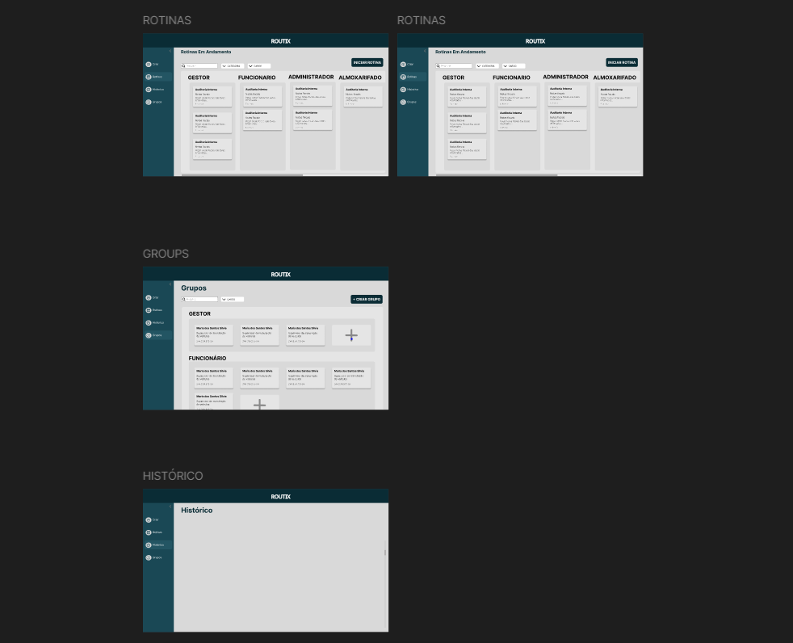

# Projeto de interface

Pré-requisitos: <a href="02-Especificacao.md"> Especificação do projeto</a>

Visão geral da interação do usuário pelas telas do sistema e protótipo interativo das telas com as funcionalidades que fazem parte do sistema (wireframes).

 Apresente as principais interfaces da plataforma. Discuta como ela foi elaborada de forma a atender os requisitos funcionais, não funcionais e histórias de usuário abordados na <a href="02-Especificacao.md"> Especificação do projeto</a>.

 ## User flow

A imagem apresenta o fluxo de navegação da interface do sistema Routix, especificamente relacionado à gestão de rotinas e tarefas. O diagrama mostra, de forma estruturada, as telas pelas quais o usuário pode transitar ao criar, editar, deletar ou associar itens a uma rotina. As setas vermelhas indicam o caminho entre as diferentes funcionalidades, permitindo visualizar como as ações se encadeiam dentro da aplicação. Essa representação é fundamental para entender a lógica de interação do usuário com o sistema, auxiliando tanto no desenvolvimento quanto na validação da usabilidade.

### Diagrama de fluxo

A imagem ilustra um fluxograma de navegação funcional do sistema Routix, demonstrando as principais ações disponíveis ao usuário relacionadas à criação, visualização e exclusão de rotinas e tarefas. O diagrama segue um fluxo lógico, partindo da tela inicial até os diferentes caminhos possíveis, como cadastrar uma nova tarefa, criar uma rotina ou excluir uma existente. Cada decisão e etapa do processo está representada por diferentes formas geométricas, facilitando a compreensão da sequência de interações dentro do sistema. Este fluxo é essencial para o mapeamento da lógica de uso e para orientar tanto o desenvolvimento quanto a experiência do usuário.

## Wireframes

São protótipos usados no design de interface para sugerir a estrutura de um site web e seu relacionamento entre suas páginas. Um wireframe web é uma ilustração que mostra o layout dos elementos fundamentais na interface.

 
> **Links úteis**:
> - [Protótipos: baixa, média ou alta fidelidade?](https://medium.com/ladies-that-ux-br/prot%C3%B3tipos-baixa-m%C3%A9dia-ou-alta-fidelidade-71d897559135)
> - [Protótipos vs wireframes](https://www.nngroup.com/videos/prototypes-vs-wireframes-ux-projects/)
> - [Ferramentas de wireframes](https://rockcontent.com/blog/wireframes/)
> - [MarvelApp](https://marvelapp.com/developers/documentation/tutorials/)
> - [Figma](https://www.figma.com/)
> - [Adobe XD](https://www.adobe.com/br/products/xd.html#scroll)
> - [Axure](https://www.axure.com/edu) (Licença Educacional)
> - [InvisionApp](https://www.invisionapp.com/) (Licença Educacional)

## Interface do sistema

A interface do Routix foi desenvolvida com foco na simplicidade e na fluidez da experiência do usuário. A plataforma oferece uma navegação intuitiva por meio de telas organizadas, permitindo o gerenciamento eficiente de rotinas e tarefas. As principais interfaces incluem visualização e criação de rotinas, cadastro de tarefas e confirmação de exclusão, todas pensadas para tornar o uso do sistema direto e funcional.

### Tela principal do sistema

Descrição da tela principal do sistema.

> 

###  Telas do processo 1 - Cadastro de Usuários

Descrição da tela relativa à atividade 1 do processo 1.

> 

Descrição da tela relativa à atividade 2 do processo 1.

> 

### Telas do processo 2 - Cadastro de Rotinas

> 

Descrição da tela relativa à atividade 1 do processo 2.

> 

Descrição da tela relativa à atividade 2 do processo 2.

> 

### Telas do processo 3 - Rotinas

Descrição da tela relativa à atividade 1 do processo 2.

> 

### Telas do processo 4 - Histórico

Descrição da tela relativa à atividade 2 do processo 2.

> 
